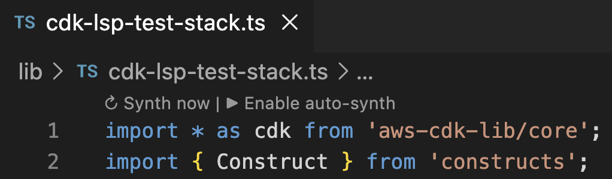
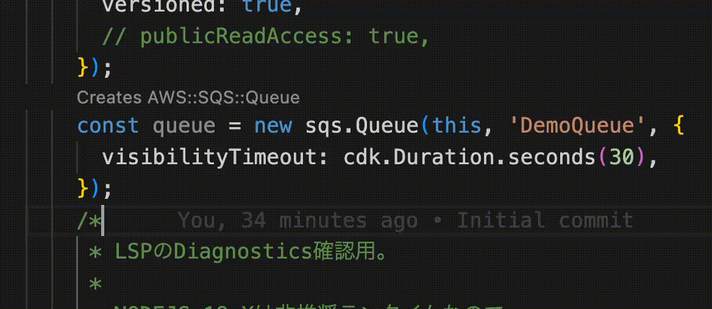
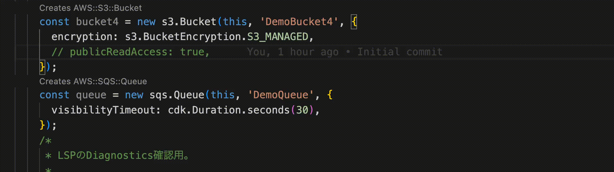

# VS Code Client for CDK LSP

[日本語版はこちら / Japanese version](./README_ja.md)

A minimal VS Code extension for trying out and learning the AWS CDK Language Server (`cdk lsp`).
The extension launches `pnpm cdk lsp` as a language server and connects it to VS Code via [`vscode-languageclient`](https://www.npmjs.com/package/vscode-languageclient).

## Features

- **CodeLens** — shows `Creates AWS::S3::Bucket` etc. on construct lines; clicking it jumps to the corresponding resource in the synthesized CloudFormation template under `cdk.out`. When one construct generates multiple resources, a QuickPick lets you choose.
- **Diagnostics** — synth errors and validation findings are surfaced as editor diagnostics.
- **Synth control** — CodeLenses at the top of the file to run synth manually or toggle auto-synth.

## Requirements

- VS Code 1.100+
- A CDK app in the workspace with a `cdk lsp`-capable `aws-cdk` installed locally (the server is resolved via `pnpm` from the workspace root)

## Source Structure

```md
.
├── examples
│   └── cdk-lsp-test # Sample CDK app for trying out the LSP
├── src
│   └── extension.ts # VS Code client implementation for cdk lsp
...
```

`src/extension.ts` is heavily commented (in English and Japanese) as learning material for how an LSP client works.

## Getting Started

```sh
pnpm install
pnpm run compile
```

Then press **F5** ("Run CDK LSP Client") in VS Code. An Extension Development Host opens with `examples/cdk-lsp-test`, where you can try CodeLens and diagnostics in `lib/cdk-lsp-test-stack.ts`.

Also install dependencies for the sample CDK app:

```sh
cd examples/cdk-lsp-test
pnpm install   # or npm install
pnpm cdk synth # templates must be generated first
pnpm cdk lsp
```

After running the above, startup options appear at the top of the code; start with `▶︎ Enable auto-synth`.



Once started, you can see which CloudFormation resources each CDK construct generates, as shown below. Clicking the CodeLens jumps to the actual definition in the CloudFormation template.



You can also catch code that fails during synth early. For example, `publicReadAccess: true` on an S3 bucket errors out at synth time, and you can see that right in VS Code.


